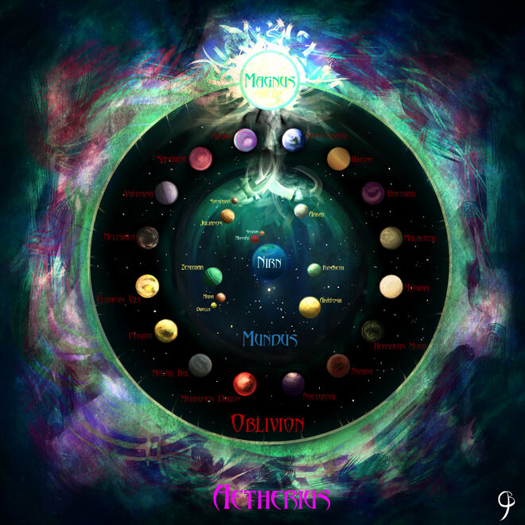
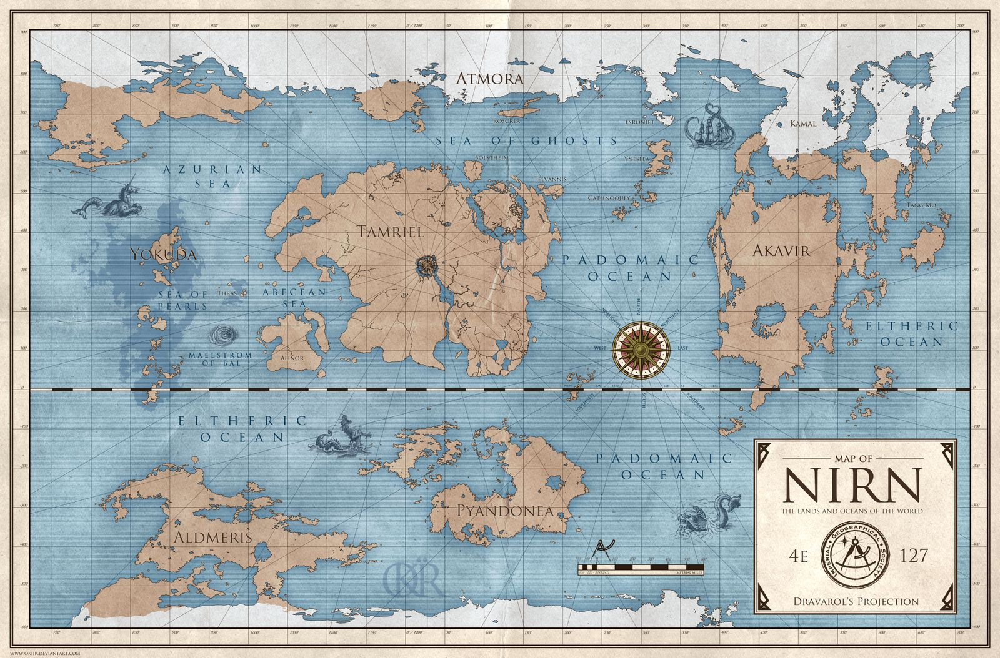
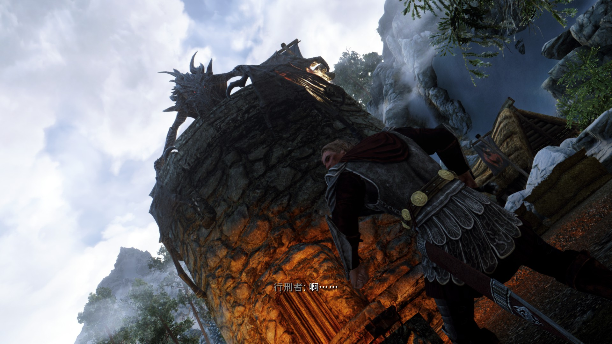

# 第一章 初到天际

话说宇宙初分之际，一片混沌。在这夹杂着11维度的复杂时空中，薄膜发生剧烈的碰撞。从那碰撞之处产生了我们的宇宙。这宇宙自产生起，充斥着大量的能量，宇宙飞速膨胀着。起先，宇宙中仅仅充斥着几乎无尽的能量，但随着慢涨，宇宙中的能量密度逐渐减少而堕入了标量势阱中。在紧接着产生的标量震荡中，光子、电子、中微子等场开始激活，宇宙正式进入大爆炸纪元。

这些粒子疯狂的碰撞、作用、结合，产生新的粒子。这些粒子通过黑格斯机制获得质量。接着，弱相互作用减弱，强相互作用开始主导。夸克和胶子的结合形成了三夸克系统，被称作重子。夸克与反夸克的结合，形成了正反粒子对，成为介子。然而随着膨胀，宇宙变得越来越空旷，这些作用变得难以为继。中微子首先和光子解耦。正反电子湮灭，将能量给了光子。三分钟之后，宇宙中的轻元素开始形成，大量的氢，转化为了氦及少量稍重的元素。不过这时期维持不久，便因更空旷的宇宙而难以为继。此时，慢下来的电子和质子相互结合，形成稳定的氢原子。大尺度结构开始形成。由大量氢原子构成的结构体里，借助氢原子与氢分子特殊的冷却机制，致密的天体结构得以形成。从而泛化出无数的恒星、行星。在这些行星之上，借助遥远恒星的辐射能量，演化出一群能够利用辐射能量的生命体，与高级生命体。

不过，这不是我们要谈的。。。

宇宙初分之际，膜的碰撞也产生了另一个宇宙。书中表为：混沌之界(Oblivion)。不知多久的演化之后，这宇宙中出现了类似的恒星与行星。在这个宇宙中，粒子之间因为某种神秘的原因，并没有和能量完全解耦。因此，粒子所形成的生命体可以通过这种未知的作用，达到控制能量，影响其他粒子的效果。而其中，有一颗叫做马格努斯(Magnus)的恒星，在这个恒星周围，一个叫做尼恩(Nirn)的星球孕育出了生命。

在这颗美丽的星球，一个叫做泰姆瑞尔的大陆上，生活着一群小精灵。他们有来自高岩的布莱顿人，有来自赛洛迪的帝国人。有来自天际的诺德人，有来自尤库达大陆的红卫人。不过我们故事的主角，是来自龙族的Dovah，奥杜因！

俗话说，早起的龙儿有饭吃。奥杜因就是一只勤劳的黑龙。这一日早早的便起床，下山吃早点。龙的胃口其实并不好，一般来说，吃一两头狼，野猪什么的就饱了。不过这天奥杜因胃口实在是好得很，原因之一是因为天际省刚刚通了WiFi。不过奥杜因还是不习惯用WiFi点外卖，毕竟别人送来的，往往都不怎么好吃，不如自己下山去找的好吃。而今早又特别幸运，奥杜因遇到了一只野熊，三只狼和一匹马。奥杜因的吃法很简单，先吐火将它们烤熟，然后直接整个吞下去。不过，吃了那么多，奥杜因觉得有点肚胀，打算回山之前，去附近走走，消消食。这一走，来到了附近人类的一个村落。只见几辆车拉着一群人正往村中走来。奥杜因对人类并不怎么感兴趣，主要是人类身上穿着一层乱七八糟的皮，咬起来很是硌牙。有时候，还不小心把人类的武器啥的卡在牙缝里。不过，这里情况甚是奇怪，人类似乎正在比赛谁的头能离开身体更久一点。第一名选手已经开始比赛，头率先离开了身体。奥杜因心下好奇，心想，这比赛着实有趣的紧。因此便飞了下来，趴在城楼上，想看看比赛到底谁能赢。眼看第二名选手登场，头放到了案子上，正准备开始比赛。奥杜因心想，第二名选手看起来眉清目秀，想必是打了Mod，我赌他能赢。谁料这时，奥杜因肚子有点涨，大概是早上吃点确实有点多，忍不住打了个嗝。这个咯正常是不会被其他龙注意到的。哪知道这群人突然变得惊慌起来，东倒西歪，似乎要取消比赛。下一名选手竟然跑到楼里躲了起来。奥杜因心道，哎呀不好，我又不小心打扰了他们的比赛。便想要解释，便伸头到塔楼里道：“不好意思，我只是打嗝，你们继续”，哪知正好打嗝之际，气息岔了，竟喷出了火。选手则夺门而逃，离开了比赛现场。奥杜因甚是抱歉，想拦住他解释经过，哪知这群人甚是彪悍，不分青红皂白开始把削尖的小棍棒，小火球啥的砸在自己身上。大感没趣，径自去了。

花开两朵，各表一枝。

话说这个正在比赛的这个小镇，叫做海尔根。那个逃跑的选手，就是我们的男主角——幻鹰。他本不小心被抓来行刑，借此龙吟虎啸之际，逃离了海尔根。一口气跑到了附近的一个叫做河木镇的小村落。幻鹰不知道龙还在不在附近，虽说龙救了自己，但想来想去都想不明白为啥龙会救我。只能得出结论，这龙恐怕高度近视加散光，认错了人。或者是发现自己“秀色可餐”，想烤来吃了。就算按下这龙不谈，那些抓了自己的帝国人也未必肯放了自己。无论如何，逃得越远越好。喘了一口气，向村子里冲了过去。

哪知一抬头，就撞到了一个人。这人中等偏瘦的身材，约莫二十来岁。似乎在魂不守舍的走路。被撞倒之后，忙向幻鹰作揖道歉。嘴里却似乎仍嘟囔着：“她一定不喜欢他的，但是她为什么不来找我。” 幻鹰心下奇怪，问道：什么他找他的？原来这人叫做斯万，是河木镇的一个诗人，平时靠在客栈卖唱维生。客栈老板一直向把他赶出去，可是老板却是个有名的怕老婆的人，什么事都要听他老婆的话。于是老板娘心好，便让他留了下来。这斯万和村里杂货店掌柜的妹妹情投意合，